# restaurent-demo

#Quick start (local dev)

1. Frontend (Express + TypeScript)
   - `cd frontend && cp .env.example .env && npm i && npm run dev`
2. Backend (Rust)
   - `cd backend && cp .env.example .env && cargo run`
3. Open the app at `http://localhost:5173` (frontend will proxy API to backend).

Notes
- Static site under `Restaurent/` is served as-is; client enhancements go in `Restaurent/assets/js/app.js`.
- Payment uses PayPal by default (Sandbox). Set `PAYPAL_CLIENT_ID`, `PAYPAL_SECRET`, `PAYPAL_API_BASE` (default sandbox). Stripe stubs remain and can be re-enabled by adding keys.
- SMTP via Brevo; add credentials in backend `.env`.

Deploy scripts
- `deploy/install.sh`: installs deps, builds, and starts backend and frontend (detached). Creates `.env` defaults if missing.
- `deploy/uninstall.sh`: stops running backend/frontend using stored PIDs.
  - Optional: set `DOMAIN` and `ADMIN_EMAIL` env before running to auto-generate a self-signed SSL cert in `certs/` and enable HTTPS for the frontend.

Environment
- Frontend `.env`: `PORT`, `BACKEND_URL`.
- Backend `.env`: `DATABASE_URL`, `JWT_SECRET`, `APP_URL`, PayPal: `PAYPAL_CLIENT_ID`, `PAYPAL_SECRET`, optional `PAYPAL_API_BASE`, `PAYPAL_WEBHOOK_ID`; Stripe (optional): `STRIPE_SECRET_KEY`, `STRIPE_WEBHOOK_SECRET`; Email: `SMTP_HOST`, `SMTP_PORT`, `SMTP_USERNAME`, `SMTP_PASSWORD`, `SMTP_FROM`.

Optional frontend HTTPS envs
- `FRONTEND_HTTPS=1`
- `FRONTEND_SSL_CERT_PATH=/absolute/path/to/cert.crt`
- `FRONTEND_SSL_KEY_PATH=/absolute/path/to/cert.key`

For Brevo SMTP:
- `SMTP_HOST=smtp-relay.brevo.com`
- `SMTP_PORT=587`
- `SMTP_USERNAME=88af27002@smtp-brevo.com` (your login)

```mermaid
graph TD
    subgraph "Entry Points"
        A["🏠 Online Customer"]
        B["🍽️ Walk-in Customer"]
    end
    
    A -->|Buy Gift Code| A1["Get QR Code"]
    A1 -->|Later| A2["Come to Restaurant"]
    A2 -->|Show QR| M["Manager<br/>Scan QR"]
    
    B -->|At Restaurant| B1["Customer Uses<br/>Phone/Website"]
    B1 -->|Place Web Order| B2["Manager Gets<br/>Notification"]
    B2 -->|Ask for QR| M
    
    M -->|Scan & Pay| C["Deduct from<br/>Gift Code"]
    C -->|Create Order| D["Kitchen<br/>Prepares"]
    D -->|Ready| E["Customer<br/>Picks Up"]
    
    style A fill:#1e40af,stroke:#60a5fa
    style B fill:#047857,stroke:#34d399
    style M fill:#7c2d12,stroke:#fb923c
    style C fill:#86198f,stroke:#e879f9
    style D fill:#7c2d12,stroke:#fb923c
    style E fill:#047857,stroke:#34d399
```

- `SMTP_PASSWORD=<your_smtp_key>`
- `SMTP_FROM=Your Restaurant Name <no-reply@yourdomain.com>` (replace with your actual domain)
    
