# restaurent-demo


#Quick start (local dev)

1. Frontend (Express + TypeScript)
   - `cd frontend && cp .env.example .env && npm i && npm run dev`
2. Backend (Rust)
   - `cd backend && cp .env.example .env && cargo run`
3. Open the app at `http://localhost:5173` (frontend will proxy API to backend).

Quick start (production deployment with Cloudflare)
```bash
# Set environment variables
export DOMAIN=yourdomain.com
export SETUP_CERTBOT=false

# Run install (will prompt for admin user on first run)
bash deploy/install.sh
```

The script will:
1. Install dependencies (Node.js 20+, Rust, SQLite)
2. Build backend and frontend
3. Configure Nginx reverse proxy
4. Initialize database with schema
5. **Prompt for admin email + password** (first-time only)
6. Start backend and frontend services

Then configure Cloudflare:
- Add DNS A record pointing to your server IP
- Set to "Proxied" (🔒) status
- SSL/TLS mode: "Full"

Notes
- Static site under `Restaurent/` is served as-is; client enhancements go in `Restaurent/assets/js/app.js`.
- Payment uses PayPal by default (Sandbox). Set `PAYPAL_CLIENT_ID`, `PAYPAL_SECRET`, `PAYPAL_API_BASE` (default sandbox). Stripe stubs remain and can be re-enabled by adding keys.
- SMTP via Brevo; add credentials in backend `.env`.

Deploy scripts
- `deploy/install.sh`: installs deps, builds, and starts backend and frontend (detached). Creates `.env` defaults if missing.
  - **First-time run**: Automatically detects fresh database and prompts to create admin user interactively
  - Optional: set `DOMAIN` env to configure Nginx reverse proxy
  - Optional: set `SETUP_CERTBOT=false` to skip certbot (use with Cloudflare proxied mode)
  - Optional: set `ADMIN_EMAIL` for certbot renewal notices
- `deploy/uninstall.sh`: stops running backend/frontend using stored PIDs, cleans up build artifacts, optionally removes database and config files.

Environment
- Frontend `.env`: `PORT`, `NEXT_PUBLIC_BACKEND_URL`.
- Backend `.env`: `DATABASE_URL`, `JWT_SECRET`, `APP_URL`, PayPal: `PAYPAL_CLIENT_ID`, `PAYPAL_SECRET`, optional `PAYPAL_API_BASE`, `PAYPAL_WEBHOOK_ID`; Stripe (optional): `STRIPE_SECRET_KEY`, `STRIPE_WEBHOOK_SECRET`; Email: `SMTP_HOST`, `SMTP_PORT`, `SMTP_USERNAME`, `SMTP_PASSWORD`, `SMTP_FROM`.

Cloudflare Proxied Setup (Recommended - No Certbot Needed!)
- When using Cloudflare proxy (🔒), **certbot cannot validate** because your IP is masked
- Solution: Let Cloudflare handle SSL automatically instead
- Set `SETUP_CERTBOT=false` to skip certbot
- Example deployment:
  ```bash
  export DOMAIN=yourdomain.com
  export SETUP_CERTBOT=false      # Skip certbot - not needed with Cloudflare!
  export ADMIN_EMAIL=admin@yourdomain.com
  bash deploy/install.sh
  ```
- Then in Cloudflare dashboard:
  - Add DNS A record pointing to your server IP
  - Set to "Proxied" (🔒) status (not "DNS only")
  - Go to SSL/TLS → Overview
  - Set mode to **"Full"** (not "Flexible")
  - Cloudflare automatically issues & manages certificates for you

Why skip certbot with Cloudflare?
- Your IP is hidden by Cloudflare proxy (IP-based validation fails)
- Cloudflare automatically issues SSL certificates
- Zero management needed - certificates auto-renew
- Your backend runs on plain HTTP internally, Cloudflare encrypts external traffic

SSL Certificate Options Comparison:

| Setup | Certbot? | Cloudflare Mode | Validation | Best For |
|-------|----------|-----------------|-----------|----------|
| **Cloudflare + Proxied** | ❌ No | Proxied (🔒) | Cloudflare handles it | Production with Cloudflare |
| **Cloudflare + DNS only** | ✅ Yes | DNS only (⚙️) | HTTP/DNS validation | Mix of proxied & direct traffic |
| **No Cloudflare** | ✅ Yes | N/A | HTTP/DNS validation | Direct domain management |

For most users: **Use Cloudflare Proxied + skip certbot** ✅

For Brevo SMTP:
- `SMTP_HOST=smtp-relay.brevo.com`
- `SMTP_PORT=587`
- `SMTP_USERNAME=88af27002@smtp-brevo.com` (your login)

```mermaid
graph TD
    subgraph "Entry Points"
        A["🏠 Online Customer"]
        B["🍽️ Walk-in Customer"]
    end
    
    A -->|Buy Gift Code| A1["Get QR Code"]
    A1 -->|Later| A2["Come to Restaurant"]
    A2 -->|Show QR| M["Manager<br/>Scan QR"]
    
    B -->|At Restaurant| B1["Customer Uses<br/>Phone/Website"]
    B1 -->|Place Web Order| B2["Manager Gets<br/>Notification"]
    B2 -->|Ask for QR| M
    
    M -->|Scan & Pay| C["Deduct from<br/>Gift Code"]
    C -->|Create Order| D["Kitchen<br/>Prepares"]
    D -->|Ready| E["Customer<br/>Picks Up"]
    
    style A fill:#1e40af,stroke:#60a5fa
    style B fill:#047857,stroke:#34d399
    style M fill:#7c2d12,stroke:#fb923c
    style C fill:#86198f,stroke:#e879f9
    style D fill:#7c2d12,stroke:#fb923c
    style E fill:#047857,stroke:#34d399
```

- `SMTP_PASSWORD=<your_smtp_key>`
- `SMTP_FROM=Your Restaurant Name <no-reply@yourdomain.com>` (replace with your actual domain)
    

